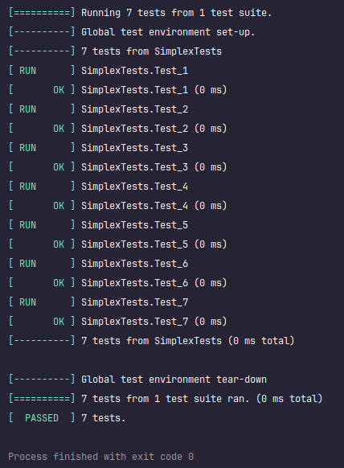

# Simplex Algorithm

## About the Project
This project implements the Simplex algorithm, a widely used method for solving linear programming problems. Linear programming involves optimizing a linear objective function, subject to a set of linear inequality constraints. The Simplex algorithm iteratively improves the solution until an optimal solution is reached.

## Run

1. Switch to the main branch.
2. Run main.cpp.
3. Follow the instructions provided by the program to input the necessary problem parameters and constraints.

## Testing

In order to launch tests, please do the following:

1. Install [GTest](https://google.github.io/googletest/quickstart-cmake.html) from the repository
2. Make sure CMake is installed on your device
3. Switch to the `testing` branch and execute application

### Result:

